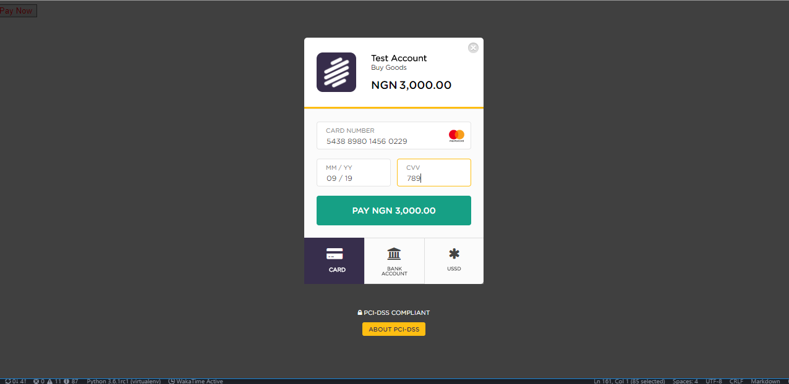
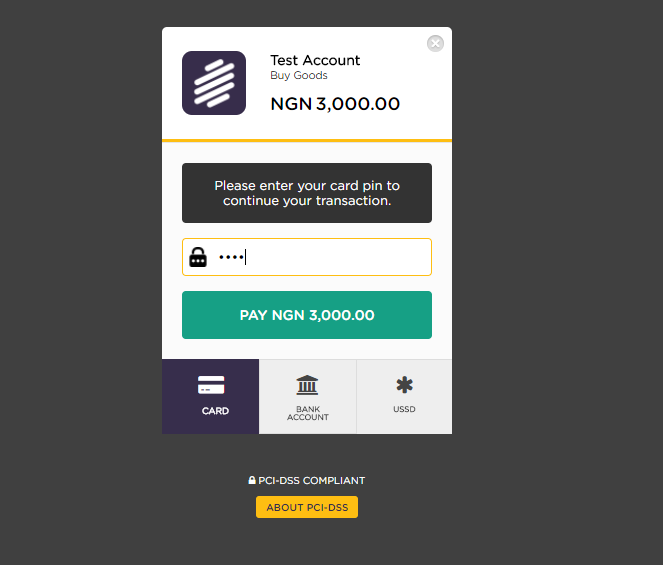
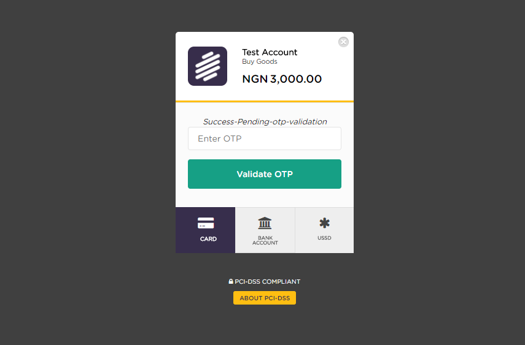
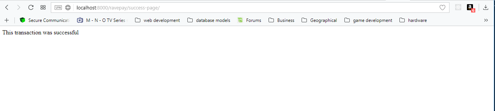

## Django Ravepay

[](https://travis-ci.org/gbozee/django-ravepay.svg?branch=master
)


This is a reusable django library that makes it very easy to hook up [Rave](https://ravepay.co) purchase button to your site/app. It helps with the verification of the transaction and is highly conifgurable.

Usage:

1. Install `django-ravepay`
```
pip install -e git+https://github.com/gbozee/django-ravepay.git@master#egg=ravepay
```

2. Add `paystack` to your `settings` module
```
INSTALLED_APPS = [
    ...,
    ravepay,

]
```

3. Add `url(r'^ravepay/', include('ravepay.urls',namespace='ravepay'))` to your base `urls.py` file
```
urlpatterns = [
    ...,
    url(r'^ravepay/', include('ravepay.urls',namespace='ravepay')),
]
```

4. Login to [Rave settings Dashboard](http://rave.frontendpwc.com/dashboard/addons/pay-button-x/) and fetch your `PUBLIC_KEY` and `SECRET_KEY`. You might need to create a checkout button if you don't have any yet. paste these keys in your `settings.py`

```
# settings.py

RAVEPAY_PUBLIC_KEY=******,
RAVEPAY_SECRET_KEY=******
```


5. In the html where you want to insert the payment button

```

...



```

6. A `signal` is provided with the verified  reference as well as the amount

```
from ravepay.signals import payment_verified

from django.dispatch import receiver

@receiver(payment_verified)
def on_payment_verified(sender, ref,amount, **kwargs):
    """
    ref: paystack reference sent back.
    amount: amount in Naira or the currency passed
    """
    pass
```

### Configurations

**Required**

`RAVEPAY_PUBLIC_KEY`

`RAVEPAY_SECRET_KEY`

_Optional_

`RAVEPAY_FAILED_URL` # Redirect url when payment fails, default is `ravepay:failed_url`

`RAVEPAY_SUCCESS_URL` # Redirect url when payment is successful, default is `ravepay:success_url`

`RAVEPAY_LIB_MODULE` # module directory to overide default implemenation of library that calls paystack api, default is `ravepay.utils`


### Template Tag Usage

the template tag `paystack_button` takes the following argument

`button_style`: css class to style the button

`button_id`: id name for the button: default is "django-ravepay-button"

`email`: a required field representing the email

`amount`: a required the amount to be paid. `

`ref`: an optional field representing the reference of the transaction. is automatically generated for you if none is passed`

`phone`: optional phone number of the user e.g `2348032233223`

`country`: optional. Default is `NG`

`first_name`: optional. 

`last_name`: optional.

`description`: The description to be displayed on the payment modal

`currency`: The currency for the payment. default is `NGN` others are `USD`, `GHS`, `KES`, `EUR`, `GBP`

`redirect_url`: an optional field representing the redirect url after payment has been made, defaults to `ravepay:verify_payment`

**NB**: *If you prefer using css to style html tags, the id of the button is *


**To view the sample test project, do the following**
```
$ git clone https://github.com/gbozee/django-ravepay.git
$ git checkout develop
$ pip install -r requirements.txt
$ pip install -e .

```

**NB:** If you use [pipenv](https://github.com/kennethreitz/pipenv), do the following
```
$ pipenv install

```

To run the project
```
$ cd django_paystack
$ python manage.py runserver

```











## Extending
The default templates used can be extended to include your custom content.

1. Create a `ravepay` directory in your `templates` folder.

The templates used are as follows.

```
ravepay/failed-page.html
ravepay/success-page.html
```

## Related Projects

[django-paystack](https://github.com/gbozee/django-paystack)

## Test Card

Test card credentials can be gotten from [here](https://flutterwavedevelopers.readme.io/docs/test-cards)